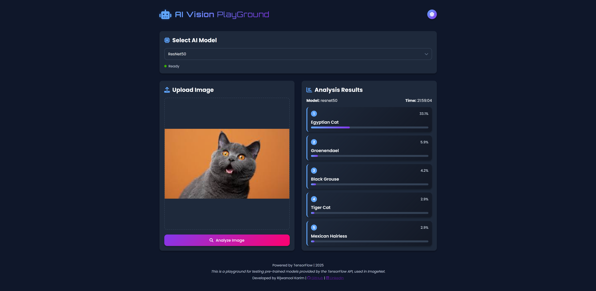

# AI Vision Playground

[](https://www.python.org/)
[](https://www.tensorflow.org/)
[](LICENSE)
[](https://flask.palletsprojects.com/)

> **A modern web app to test and compare multiple pre-trained image classification models using TensorFlow and Flask.**

---

## Table of Contents

- [Project Description](#project-description)
- [Features](#features)
- [Screenshots](#screenshots)
- [Setup and Installation](#setup-and-installation)
- [Usage](#usage)
- [Project Structure](#project-structure)
- [Deployment](#deployment)
- [Contributing](#contributing)
- [License](#license)

---

## Project Description

AI Vision Playground is a web application for testing and comparing various pre-trained image classification models from the TensorFlow API. It demonstrates how different deep learning models (trained on ImageNet) perform on diverse image inputs. The app features a modern, responsive UI built with Flask, HTML, CSS, and JavaScript, allowing users to select a model, upload an image, and view classification results in real time.

---

## Features

- 🚀 **Multiple Pre-trained Models:** Choose from ResNet50, MobileNetV2, InceptionV3, EfficientNetB0, and VGG16.
- 🎨 **Modern UI:** Clean, futuristic design with dark/light theme toggle and responsive layout.
- 📤 **Image Upload & Preview:** Drag-and-drop or browse to upload images, with instant preview.
- ⚡ **Real-time Analysis:** Immediate classification predictions with confidence scores.
- 📊 **Clear Results Display:** Organized, easy-to-understand results with confidence bars.
- 🛠️ **Production Ready:** Includes `requirements.txt` and WSGI server instructions for deployment.

---

## Screenshots
> UI preview 



---

## Setup and Installation

1. **Clone the Repository:**
    ```bash
    git clone https://github.com/A3x-parvez/Multiple_Model_IMG_Prediction_UI.git
    cd Multiple_Model_IMG_Prediction_UI
    ```

2. **Create and Activate a Virtual Environment:**
    ```bash
    python -m venv venv
    # On Windows:
    .\venv\Scripts\activate
    # On macOS/Linux:
    source venv/bin/activate
    ```

3. **Install Dependencies:**
    ```bash
    pip install -r requirements.txt
    ```

---

## Usage

1. **Run the Flask Application:**
    ```bash
    python app.py
    ```
    The app will be available at [http://127.0.0.1:5000](http://127.0.0.1:5000).

2. **Select a Model:** Choose a pre-trained model from the dropdown.

3. **Upload an Image:** Drag and drop or browse to select an image.

4. **Analyze Image:** Click "Analyze Image" to view classification results.

---

## Project Structure

```
Multiple_Model_IMG_Prediction_UI/
├── README.md
├── app.py
├── requirements.txt
├── static/
│   ├── css/
│   │   └── style.css
│   ├── js/
│   │   └── main.js
│   └── screenshots/
│       └── demp.png
└── templates/
    └── index.html
```

---

## Contributing

Contributions are welcome! Please open issues or submit pull requests for improvements or bug fixes.

---

## About Me

Hi! I’m **Parvez**, a passionate AI and ML enthusiast and software developer.  
I love building innovative projects that blend deep learning with practical applications.  
Feel free to explore my work, reach out, or collaborate on exciting ideas!

---

## Social Media

Connect with me on:  

[](https://github.com/A3x-parvez)  
[](https://linkedin.com/in/rijwanool-karim/)  

---

## Contact / Support

If you have any questions or want to get in touch:

- GitHub : [A3x-parvez](https://github.com/A3x-parvez)  
- Email : rijwanoolkarim143r@gmail.com


## License

This project is licensed under the MIT License. See the [LICENSE](LICENSE) file for details.

---
